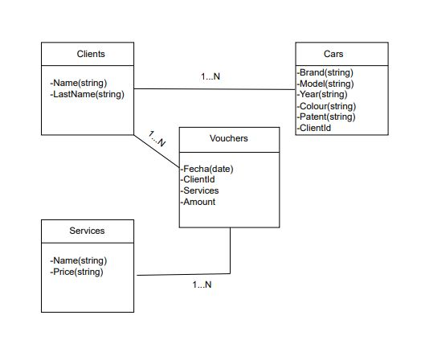

# mecanic-API
API REST for mechanical service management.

It is developed with nodejs, Express, Mongoose and TypeScript.

### How to run server?

1. Copy the `env.txt` vars inside a local `.env`.
2. `npm i`
3. `npm run dev`
  
### How to call endpoints?
| ENDPOINT NAME  | URL              | HTTP METHOD | BODY                                                                    |
| -------------- | ---------------- | ----------- | ----------------------------------------------------------------------- |
| CreateClient          | `/client/`    | POST        | `{name: "test", lastName: "Test"}`                                            |
| GetAllClient       | `/client/` | GET         | -    
| CreateVoucher       | `/voucher/` | POST         | `{carId: "6245c86a0915197e08feb2b8", services: ["6245c8ab0915197e08feb2c0","6245c8ab0915197e08feb2c52"]}`                                            |      
| GetAllClient       | `/voucher/` | GET         | - 
| CreateService       | `/service/` | POST         | `{name: "Pintura", price: "300"}` 
| GetAllService       | `/service/` | GET         | - 
| CreateCar       | `/car/` | POST         | `{brand: "ford", model: "focus", year: "2012", patent: "asd121", colour: "blanco", clientId: "6245c8440915197e08feb2b6"}` 
| GetById       | `/car/:id` | GET         | - 
| GetAllCar       | `/car/` | GET         | - 
| EditCar       | `/car/:id` | PUT         | `{brand: "fordEdit", model: "focusEdit", year: "2012Edit", patent: "asd121Edit", colour: "blancoEdit"}`  
| DeleteCar       | `/car/:id` | DELETE         | - 
| GetHistoryCar       | `car/history/:id` | GET         | - 

### Diagram database
##
